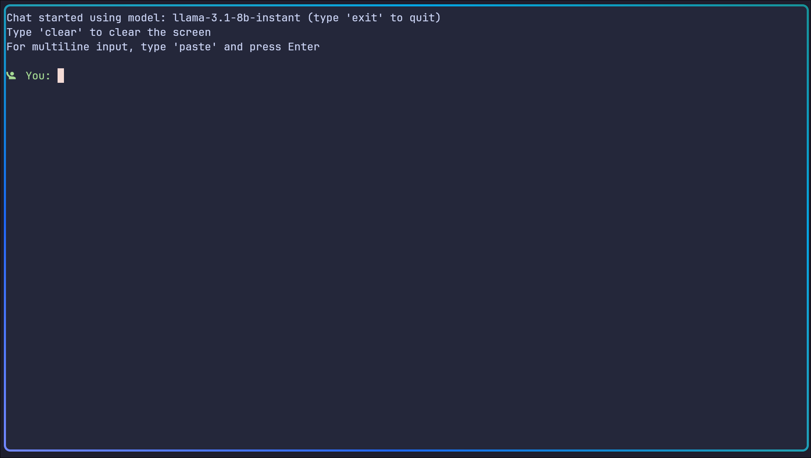

# chat-cli

Chat with Groq-powered AI models directly in your terminal CLI.



## Purpose

This `chat-cli` is designed to provide a simple, fast, and free alternative for chatting with Groq-powered AI models directly in your terminal. Unlike other large language models (LLMs) such as OpenAI's GPT, Gemini, or Claude, this tool is completely free to use--you don't pay anything-- and prioritizes ease of use.

The tool supports multiple models such as `mixtral`, `llama-70b`, and `llama-8b-instant` (default), and allows seamless interaction with these models via a command-line interface.

## Features

- Model Selection: Easily switch between available models (e.g. `mixtral`, `llama-70b`, and `llama-8b-instant`) using the GROQ_MODEL environment variable.
- Verbose Mode: Enable detailed metrics such as elapsed time, tokens processed, and speed using the -v flag.
- Multiline Input: Type or paste multiline input seamlessly using the paste command.
- Clear Screen: Use the clear command to reset the terminal screen.

- Color-Coded Output:
  - User input is displayed in green (👤 You:).
  - Assistant output is displayed in magenta (🤖 Assistant:).

## Installation

You can install the chat cli application using the `go install` command:

```go
go install github.com/theDataFixer/chat-cli@latest
```

## Usage

### Environment Variables

If you haven't created your Groq API key, go to the [GroqCloud Console](https://console.groq.com), create an account and create the key.

Set your Groq API Key for authentication:

```bash
export GROQ_API_KEY=your-api-key-here
```

Set your preferred model (default is `llama-8b-instant`)

```bash
export GROQ_MODEL=llama-8b-instant # Options: mixtral, llama-70b, llama-instant
```

### Start Chatting

After installation, you can start the chat CLI by running:

```bash
chat-cli
```

### Enable Verbose Mode

To enable verbose mode (some metrics like time elapsed, tokens, etc), use:

```bash
chat-cli -v
```

### Multiline Input

To paste multiline input:

1. Type paste and press Enter.
2. Paste your text.
3. Type done on a new line to finish.

### Clear Screen

To clear the screen during a session:

```bash
clear
```

### Exit Chat

To exit the chat session:

```bash
exit
```

### Model details

The following models are:

| Model Name    | Description          | Context Length |
| ------------- | -------------------- | -------------- |
| mixtral       | Best for creativity  | 32,768 tokens  |
| llama-70b     | Versatile but larger | 8,192 tokens   |
| llama-instant | Fastest              | 8,192 tokens   |

You can change the model dynamically by setting the GROQ_MODEL environment variable.

## Troubleshooting

If you encounter issues during installation or running the application, check the following:

- Ensure Go is properly installed and configured.
- Verify that your `GOPATH` is set correctly.
- Make sure you have set your Groq API key (`GROQ_API_KEY`) in your environment variables.

### Example Session

```shell
Chat started using model: llama-8b-instant (type 'exit' to quit)
Type 'clear' to clear the screen
For multiline input, type 'paste' and press Enter

👤 You: Tell me a palindrome Python code
🤖 Assistant: Here's a simple Python code to check if a given word is a palindrome:

def is_palindrome(word):
    return word == word[::-1]

# Test the function
print(is_palindrome("racecar"))  # True
print(is_palindrome("python"))   # False

👤 You: Thanks!
🤖 Assistant: You're welcome! Let me know if you need anything else.
```

## Notes:

- It is a simple binary, with some minor tweaks regarding decorations.
- It is a project for learning Golang, so you may find some bad practices or some bad code (if so, please let me know).
- Hopefully this `chat-cli` will become more robust either by contributions or by personal upgrades.

## Contributing

Contributions are welcome. Please fork the repository and submit a pull request with your changes.

### Questions?

For any inquiries or support, please reach out at: *thedatafixer@tuta.io*
